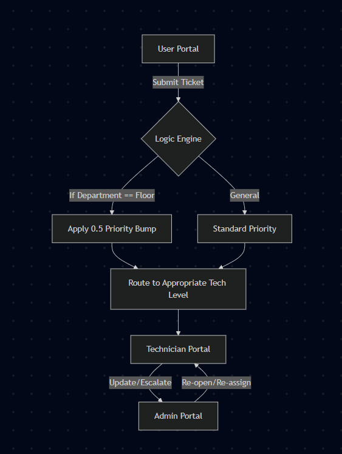

# TicketFlow

## Description
TicketFlow is a streamlined, priority-based ticketing management system designed to optimize internal IT support workflows. By automating the routing of technical support requests based on category and department, TicketFlow minimizes resolution time and ensures critical infrastructure issues—such as data center operations—are escalated immediately.

[▶️ **Watch the TicketFlow Demo Video**](https://drive.google.com/file/d/1E7cGbRrczQZsQfjPmg3pypjBJA0h2JXs/view)

## Motivation
To automate priority-based ticketing for internal IT support, reducing manual administrative overhead and ensuring high-priority requests are handled by the appropriate technical level.

---

## Table of Contents
1. [Getting Started/Installation](#getting-startedinstallation)
2. [Usage](#usage)
3. [Features](#features)
4. [Project Status](#project-status)
5. [Contributing](#contributing)
6. [License](#license)
7. [Team Contributions](#team-contributions)

---

## Getting Started/Installation
### Prerequisites
As this is a prototype for CSCI3300, the application is designed to be run in a standard web browser. No complex server-side installation is required.
* **Browser:** Any modern web browser (Chrome, Firefox, Edge, or Safari).
* **Environment:** Ensure all project files are contained within the same root directory to allow proper linking between the HTML, CSS, and JavaScript files.

### Installation
1. Clone or download the repository to your local machine.
2. Navigate to the project folder.
3. Locate `TicketFlow.html`.
4. Right-click the file and select **"Open with"** followed by your preferred web browser.

---

## Usage
Open `TicketFlow.html` in your browser and use the following credentials to explore the different portals:

| Role | Email / Username | Password |
| :--- | :--- | :--- |
| **Level 1 Tech** | technician1@company.com | 1234 |
| **Level 2 Tech** | technician2@company.com | 1234 |
| **Level 3 Tech** | technician3@company.com | 1234 |
| **User** | user@company.com | *Any* |
| **Admin** | admin | admin |

---

## Features
* **Authentication:** Secure login screen with role-based access control.
* **Accessibility:** Integrated light and dark mode toggles to reduce eye strain.

### User Portal
* **Dashboard:** Visual overview of Open and Closed tickets.
* **Ticket Submission:** Form for new issues (Subject, Description, Category, Department, Priority, and Expected Date of Resolution).
* **Smart Routing:** Automatic routing to specific technician levels.
* **Priority Logic:** Any "Floor" department selection triggers a 0.5 priority level bump.
* **Ticket Tracking:** Users can view full ticket details, activity history, and cancel their own requests.

### Technician Portal
* **Dashboard:** View tickets specifically assigned to your technical level.
* **Ticket Management:** View descriptions and all user-submitted metadata.
* **Actionable Updates:** Ability to add internal notes, escalate tickets to higher levels/Admin, and update status (Open/Hold/Cancelled/Escalated/Closed).
* **Resolution:** Final resolution popup required when closing a ticket.

### Admin Portal
* **Global Oversight:** Ability to view all technician tickets across all levels (Open and Closed).
* **Full Control:** All technician-level capabilities, plus the ability to re-open and re-assign any ticket in the system.

### System Architecture

---

## Project Status
TicketFlow is a working prototype developed for the CSCI3300 Summer 2026 course.

---

## Contributing
* **Guidelines:** The project is built using Java, CSS, JavaScript, and HTML. Please maintain consistent coding standards when suggesting improvements.
* **Contact:** * jlcand1787@ung.edu 
    * eanoon7612@ung.edu 
    * aifern2399@ung.edu 
    * tdpryc0420@ung.edu

---

## License
This project is licensed under the MIT License. This is a common open-source license that allows others to use, copy, and modify the code freely for educational or commercial purposes, provided the original copyright notice is included.

---

## Team Contributions
* **Ethan Nooner:** Developed the base Java logic for ticketing and authentication.
* **Joanne Candia:** Designed the HTML/CSS prototype for portals and the login screen; created the TicketFlow logo.
* **Tailand Pryce:** Implemented the back-end Java routing logic and Admin control capabilities.
* **Alexander Fernandez:** Engineered the user login credentials and integrated technician-level logic; transitioned priority handling to a technician-based model.
* **All:** Participated in the iterative review process, feature brainstorming, and consensus-based decision-making. Group #5 operated collaboratively with equal contribution from all members. (This README file has been approved by all members.)

